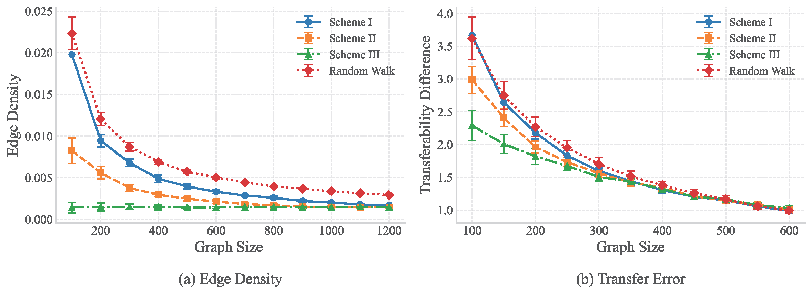
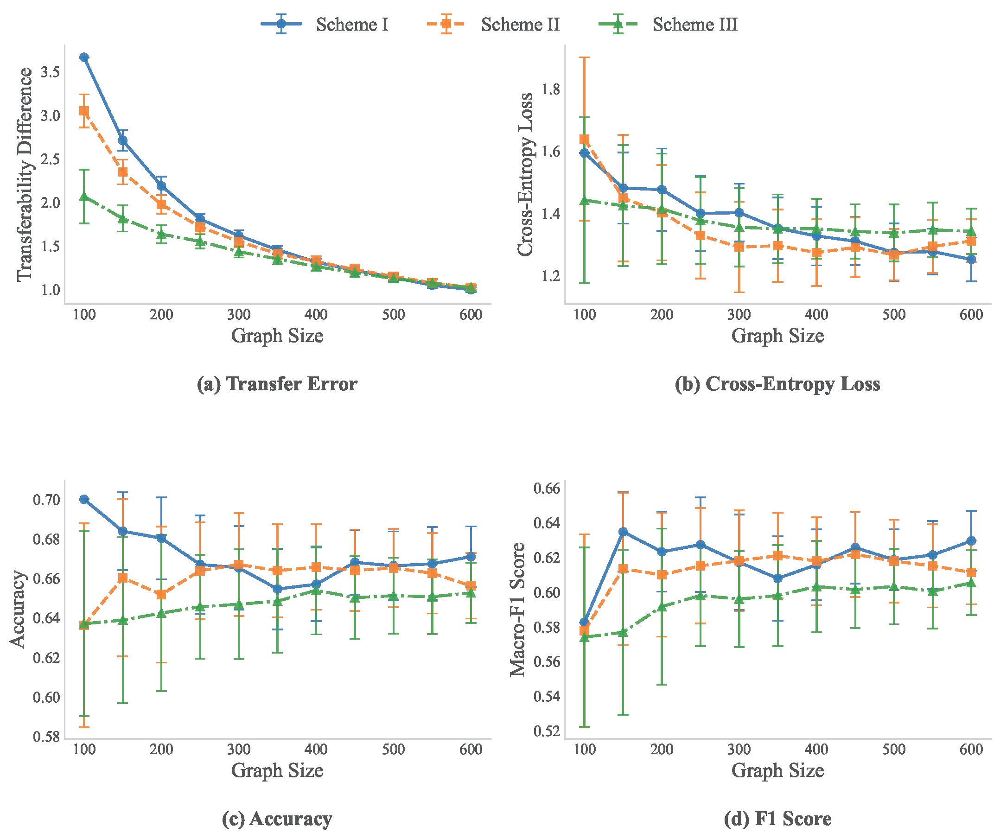

## Supplemental Experiments

###  [Q4 & L2] Experiment of Random Walk on Cora

*( The high-resolution figure are available in . )*

### [Q5] Comparison with Baseline 

*( The high-resolution figure are available in . )*

### [Q6] Downstream Performance

*( The high-resolution figure are available in . )*

